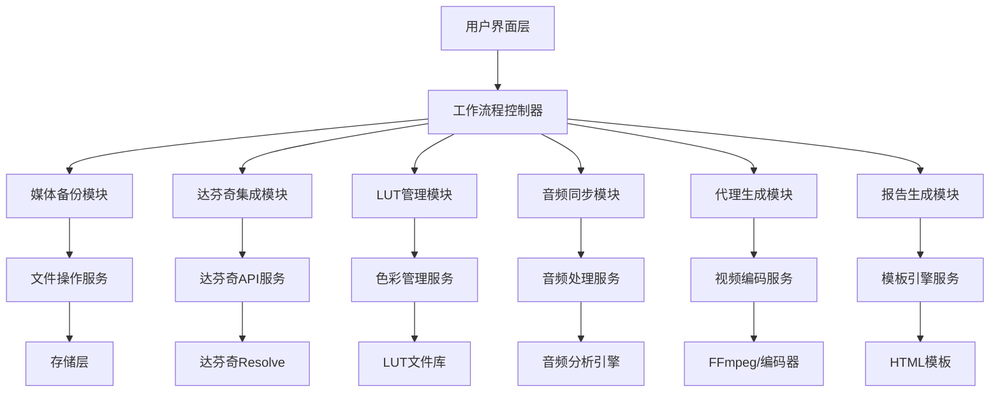

# 设计文档

## 概述

达芬奇工作流程自动化系统是一个基于Python的综合解决方案，旨在自动化视频制作工作流程的关键步骤。系统采用模块化架构，支持从媒体备份到最终报告生成的完整工作流程。

系统的核心设计理念是可靠性、可扩展性和用户友好性。通过与达芬奇Resolve的深度集成，系统能够无缝地处理媒体导入、色彩管理、音频同步和代理生成等复杂任务。

## 架构

### 系统架构图



### 核心组件

1. **工作流程控制器 (WorkflowController)**
   - 协调所有工作流程步骤
   - 管理任务队列和执行顺序
   - 处理错误恢复和重试逻辑

2. **达芬奇集成模块 (ResolveIntegration)**
   - 封装达芬奇Resolve API调用
   - 管理项目创建和媒体导入
   - 处理时间线操作和色彩管理

3. **媒体处理引擎 (MediaProcessor)**
   - 统一的媒体文件处理接口
   - 支持多种视频和音频格式
   - 提供元数据提取和分析功能

## 组件和接口

### 1. 用户界面层

#### GUI应用程序 (MainApplication)
```python
class MainApplication:
    def __init__(self):
        self.language_manager = LanguageManager()
        self.config_manager = ConfigManager()
        self.workflow_controller = WorkflowController()
    
    def setup_ui(self):
        # 创建主窗口和控件
        pass
    
    def start_workflow(self, source_path: str, config: dict):
        # 启动工作流程
        pass
```

#### 语言管理器 (LanguageManager)
```python
class LanguageManager:
    def __init__(self):
        self.current_language = "zh_CN"
        self.translations = {}
    
    def load_translations(self, language: str):
        # 加载翻译文件
        pass
    
    def translate(self, key: str) -> str:
        # 返回翻译后的文本
        pass
```

### 2. 工作流程控制层

#### 工作流程控制器 (WorkflowController)
```python
class WorkflowController:
    def __init__(self):
        self.steps = []
        self.current_step = 0
        self.logger = Logger()
    
    async def execute_workflow(self, config: WorkflowConfig):
        # 执行完整工作流程
        pass
    
    def add_step(self, step: WorkflowStep):
        # 添加工作流程步骤
        pass
```

#### 工作流程步骤基类 (WorkflowStep)
```python
from abc import ABC, abstractmethod

class WorkflowStep(ABC):
    def __init__(self, name: str):
        self.name = name
        self.status = StepStatus.PENDING
    
    @abstractmethod
    async def execute(self, context: WorkflowContext) -> StepResult:
        pass
    
    def rollback(self, context: WorkflowContext):
        # 回滚操作
        pass
```

### 3. 媒体备份模块

#### 备份管理器 (BackupManager)
```python
class BackupManager(WorkflowStep):
    def __init__(self, backup_locations: List[str]):
        super().__init__("媒体备份")
        self.backup_locations = backup_locations
        self.file_operations = FileOperations()
    
    async def execute(self, context: WorkflowContext) -> StepResult:
        # 执行多重备份
        pass
    
    def verify_backup(self, source: str, destination: str) -> bool:
        # 验证备份完整性
        pass
```

### 4. 达芬奇集成模块

#### 达芬奇集成器 (ResolveIntegrator)
```python
class ResolveIntegrator(WorkflowStep):
    def __init__(self):
        super().__init__("达芬奇集成")
        self.resolve = None
        self.project = None
    
    def connect_to_resolve(self) -> bool:
        # 连接到达芬奇Resolve
        pass
    
    def create_project(self, project_config: ProjectConfig) -> bool:
        # 创建新项目
        pass
    
    def import_media(self, media_paths: List[str]) -> List[MediaPoolItem]:
        # 导入媒体文件
        pass
```

### 5. LUT管理模块

#### LUT管理器 (LUTManager)
```python
class LUTManager(WorkflowStep):
    def __init__(self, lut_library_path: str):
        super().__init__("LUT应用")
        self.lut_library_path = lut_library_path
        self.lut_mappings = {}
    
    def load_lut_mappings(self):
        # 加载LUT映射配置
        pass
    
    def select_lut_for_clip(self, clip_metadata: dict) -> str:
        # 根据片段元数据选择合适的LUT
        pass
    
    def apply_lut_to_clips(self, clips: List[MediaPoolItem], timeline: Timeline):
        # 为片段应用LUT
        pass
```

### 6. 音频同步模块

#### 音频同步器 (AudioSynchronizer)
```python
class AudioSynchronizer(WorkflowStep):
    def __init__(self):
        super().__init__("音频同步")
        self.sync_engine = AudioSyncEngine()
    
    def detect_sync_candidates(self, video_clips: List[MediaPoolItem], 
                             audio_clips: List[MediaPoolItem]) -> List[SyncPair]:
        # 检测同步候选对
        pass
    
    def sync_audio_video(self, sync_pairs: List[SyncPair]) -> List[SyncResult]:
        # 执行音频视频同步
        pass
```

### 7. 代理生成模块

#### 代理生成器 (ProxyGenerator)
```python
class ProxyGenerator(WorkflowStep):
    def __init__(self, proxy_settings: ProxySettings):
        super().__init__("代理生成")
        self.proxy_settings = proxy_settings
        self.encoder = VideoEncoder()
    
    def should_generate_proxy(self, clip: MediaPoolItem) -> bool:
        # 判断是否需要生成代理
        pass
    
    def generate_proxy(self, clip: MediaPoolItem) -> str:
        # 生成代理文件
        pass
    
    def link_proxy_to_original(self, clip: MediaPoolItem, proxy_path: str):
        # 在达芬奇中链接代理到原始媒体
        pass
```

### 8. 报告生成模块

#### 报告生成器 (ReportGenerator)
```python
class ReportGenerator(WorkflowStep):
    def __init__(self, template_path: str):
        super().__init__("报告生成")
        self.template_engine = TemplateEngine(template_path)
        self.thumbnail_generator = ThumbnailGenerator()
    
    def generate_thumbnails(self, clips: List[MediaPoolItem]) -> Dict[str, List[str]]:
        # 生成缩略图
        pass
    
    def collect_workflow_data(self, context: WorkflowContext) -> ReportData:
        # 收集工作流程数据
        pass
    
    def generate_html_report(self, report_data: ReportData) -> str:
        # 生成HTML报告
        pass
```

## 数据模型

### 工作流程配置 (WorkflowConfig)
```python
@dataclass
class WorkflowConfig:
    source_media_path: str
    backup_locations: List[str]
    project_name: str
    project_settings: ProjectSettings
    lut_settings: LUTSettings
    proxy_settings: ProxySettings
    report_settings: ReportSettings
    language: str = "zh_CN"
```

### 项目设置 (ProjectSettings)
```python
@dataclass
class ProjectSettings:
    timeline_resolution_width: int
    timeline_resolution_height: int
    timeline_frame_rate: float
    color_space: str
    working_color_space: str
```

### LUT设置 (LUTSettings)
```python
@dataclass
class LUTSettings:
    auto_apply: bool
    lut_library_path: str
    camera_lut_mappings: Dict[str, str]
    default_lut: str
```

### 代理设置 (ProxySettings)
```python
@dataclass
class ProxySettings:
    enabled: bool
    resolution_threshold: Tuple[int, int]  # (width, height)
    codec: str
    quality: str
    proxy_location: str
```

### 同步结果 (SyncResult)
```python
@dataclass
class SyncResult:
    video_clip: MediaPoolItem
    audio_clip: MediaPoolItem
    sync_offset: float
    confidence: float
    status: SyncStatus
    error_message: Optional[str] = None
```

## 错误处理

### 错误处理策略

1. **分层错误处理**
   - 每个模块负责处理自己的特定错误
   - 工作流程控制器处理全局错误和协调
   - 用户界面层处理用户交互错误

2. **错误恢复机制**
   - 自动重试机制（指数退避）
   - 部分失败时的继续执行策略
   - 关键步骤的回滚支持

3. **错误分类**
   ```python
   class WorkflowError(Exception):
       def __init__(self, message: str, error_code: str, recoverable: bool = True):
           self.message = message
           self.error_code = error_code
           self.recoverable = recoverable
   
   class ResolveConnectionError(WorkflowError):
       pass
   
   class MediaImportError(WorkflowError):
       pass
   
   class BackupError(WorkflowError):
       pass
   ```

### 日志记录系统

```python
class WorkflowLogger:
    def __init__(self, log_level: str = "INFO"):
        self.logger = logging.getLogger("workflow")
        self.setup_handlers()
    
    def setup_handlers(self):
        # 设置文件和控制台处理器
        pass
    
    def log_step_start(self, step_name: str):
        pass
    
    def log_step_complete(self, step_name: str, duration: float):
        pass
    
    def log_error(self, error: Exception, context: dict):
        pass
```

## 测试策略

### 单元测试
- 每个模块的核心功能测试
- 模拟达芬奇API调用进行测试
- 错误处理路径的测试覆盖

### 集成测试
- 端到端工作流程测试
- 与真实达芬奇实例的集成测试
- 多种媒体格式的兼容性测试

### 性能测试
- 大文件处理性能测试
- 并发操作性能测试
- 内存使用优化测试

### 测试框架结构
```python
class WorkflowTestCase(unittest.TestCase):
    def setUp(self):
        self.mock_resolve = MockResolve()
        self.test_media_path = "test_data/sample_media"
    
    def test_complete_workflow(self):
        # 测试完整工作流程
        pass
    
    def test_error_recovery(self):
        # 测试错误恢复机制
        pass
```

## 代码质量和模块化设计

### Python代码标准

本项目严格遵循以下Python代码质量标准：

1. **PEP 8 代码风格**
   - 使用4个空格缩进
   - 行长度限制为88字符（Black格式化器标准）
   - 函数和变量使用snake_case命名
   - 类使用PascalCase命名
   - 常量使用UPPER_CASE命名

2. **类型注解**
   - 所有公共函数必须包含类型注解
   - 使用typing模块提供的类型提示
   - 复杂类型使用TypedDict或dataclass

3. **文档字符串**
   - 所有模块、类和公共函数必须包含docstring
   - 使用Google风格的docstring格式
   - 包含参数说明、返回值说明和异常说明

4. **代码质量工具**
   - Black: 代码格式化
   - isort: 导入排序
   - flake8: 代码检查
   - mypy: 类型检查
   - pytest: 单元测试

### 达芬奇工作流程集成架构

由于达芬奇Resolve的工作流程集成要求，我们需要采用混合架构：

1. **达芬奇插件入口** - 必须放在达芬奇指定目录
2. **核心应用程序** - 独立的Python包，可以安装在任何位置
3. **通信机制** - 插件和核心应用程序之间的通信

### 文件结构

```
# 达芬奇插件目录 (必须)
/Library/Application Support/Blackmagic Design/DaVinci Resolve/Workflow Integration Plugins/
└── AyuDIT_WorkflowPlugin.py     # 达芬奇插件入口 (<200行)

# 核心应用程序目录 (可安装在任何位置)
/Applications/AyuDIT/            # 或用户选择的安装目录
├── ayu_dit/
│   ├── __init__.py
│   ├── main.py                  # 主入口文件 (<100行)
│   ├── plugin_bridge.py         # 插件桥接器 (<150行)
│   ├── config/
│   │   ├── __init__.py
│   │   ├── settings.py          # 配置管理 (<200行)
│   │   └── constants.py         # 常量定义 (<100行)
│   ├── core/
│   │   ├── __init__.py
│   │   ├── workflow_controller.py   # 工作流程控制器 (<300行)
│   │   ├── base_step.py            # 基础步骤类 (<150行)
│   │   └── exceptions.py           # 自定义异常 (<100行)
│   ├── backup/
│   │   ├── __init__.py
│   │   ├── backup_manager.py       # 备份管理器 (<250行)
│   │   ├── file_operations.py      # 文件操作 (<200行)
│   │   └── integrity_checker.py    # 完整性检查 (<150行)
│   ├── resolve/
│   │   ├── __init__.py
│   │   ├── resolve_connector.py    # 达芬奇连接器 (<200行)
│   │   ├── project_manager.py      # 项目管理 (<250行)
│   │   ├── media_importer.py       # 媒体导入 (<200行)
│   │   └── timeline_manager.py     # 时间线管理 (<200行)
│   ├── color/
│   │   ├── __init__.py
│   │   ├── lut_manager.py          # LUT管理器 (<200行)
│   │   ├── lut_selector.py         # LUT选择器 (<150行)
│   │   └── color_utils.py          # 色彩工具 (<100行)
│   ├── audio/
│   │   ├── __init__.py
│   │   ├── sync_engine.py          # 同步引擎 (<300行)
│   │   ├── audio_analyzer.py       # 音频分析 (<200行)
│   │   └── sync_utils.py           # 同步工具 (<150行)
│   ├── proxy/
│   │   ├── __init__.py
│   │   ├── proxy_generator.py      # 代理生成器 (<250行)
│   │   ├── encoder_wrapper.py      # 编码器封装 (<200行)
│   │   └── proxy_linker.py         # 代理链接器 (<150行)
│   ├── reporting/
│   │   ├── __init__.py
│   │   ├── report_generator.py     # 报告生成器 (<200行)
│   │   ├── thumbnail_generator.py  # 缩略图生成器 (<150行)
│   │   ├── template_engine.py      # 模板引擎 (<150行)
│   │   └── data_collector.py       # 数据收集器 (<200行)
│   ├── ui/
│   │   ├── __init__.py
│   │   ├── main_window.py          # 主窗口 (<300行)
│   │   ├── progress_dialog.py      # 进度对话框 (<150行)
│   │   ├── settings_dialog.py      # 设置对话框 (<200行)
│   │   └── language_manager.py     # 语言管理器 (<150行)
│   ├── utils/
│   │   ├── __init__.py
│   │   ├── logger.py               # 日志工具 (<150行)
│   │   ├── file_utils.py           # 文件工具 (<200行)
│   │   ├── media_utils.py          # 媒体工具 (<200行)
│   │   └── validation.py           # 验证工具 (<100行)
│   └── communication/
│       ├── __init__.py
│       ├── ipc_server.py           # 进程间通信服务器 (<200行)
│       ├── message_handler.py      # 消息处理器 (<150行)
│       └── protocol.py             # 通信协议定义 (<100行)
├── tests/
├── resources/
├── requirements.txt
├── setup.py
├── pyproject.toml
└── README.md
```

### 达芬奇插件入口设计

#### AyuDIT_WorkflowPlugin.py (达芬奇插件入口)
```python
"""AyuDIT 达芬奇工作流程集成插件。

这个文件必须放在达芬奇的工作流程集成插件目录中。
它作为桥接器，连接达芬奇和AyuDIT核心应用程序。
"""

import os
import sys
import subprocess
import json
import socket
import threading
from typing import Dict, Any, Optional

# 添加核心应用程序路径到Python路径
AYUDIT_INSTALL_PATH = "/Applications/AyuDIT"  # 可配置
if os.path.exists(AYUDIT_INSTALL_PATH):
    sys.path.insert(0, AYUDIT_INSTALL_PATH)

try:
    from ayu_dit.communication.ipc_server import IPCClient
    from ayu_dit.utils.logger import get_logger
except ImportError:
    # 如果无法导入，尝试启动独立进程
    pass

# 获取达芬奇Resolve对象
resolve = None
project = None

logger = None

class AyuDITPlugin:
    """AyuDIT插件主类。"""
    
    def __init__(self):
        """初始化插件。"""
        self.ipc_client: Optional[IPCClient] = None
        self.core_process: Optional[subprocess.Popen] = None
        self.setup_logging()
        
    def setup_logging(self):
        """设置日志记录。"""
        global logger
        try:
            from ayu_dit.utils.logger import get_logger
            logger = get_logger("davinci_plugin")
        except ImportError:
            import logging
            logging.basicConfig(level=logging.INFO)
            logger = logging.getLogger("davinci_plugin")
    
    def start_core_application(self) -> bool:
        """启动核心应用程序。
        
        Returns:
            是否成功启动
        """
        try:
            # 检查核心应用程序是否已经运行
            if self.is_core_running():
                logger.info("核心应用程序已在运行")
                return True
            
            # 启动核心应用程序
            core_script = os.path.join(AYUDIT_INSTALL_PATH, "ayu_dit", "main.py")
            if not os.path.exists(core_script):
                logger.error(f"核心应用程序未找到: {core_script}")
                return False
            
            self.core_process = subprocess.Popen([
                sys.executable, core_script, "--daemon"
            ])
            
            # 等待核心应用程序启动
            import time
            time.sleep(2)
            
            return self.is_core_running()
            
        except Exception as e:
            logger.error(f"启动核心应用程序失败: {e}")
            return False
    
    def is_core_running(self) -> bool:
        """检查核心应用程序是否运行。
        
        Returns:
            是否正在运行
        """
        try:
            # 尝试连接到IPC服务器
            sock = socket.socket(socket.AF_INET, socket.SOCK_STREAM)
            sock.settimeout(1)
            result = sock.connect_ex(('localhost', 9999))  # 默认端口
            sock.close()
            return result == 0
        except:
            return False
    
    def connect_to_core(self) -> bool:
        """连接到核心应用程序。
        
        Returns:
            是否成功连接
        """
        try:
            if not self.ipc_client:
                self.ipc_client = IPCClient('localhost', 9999)
            
            return self.ipc_client.connect()
            
        except Exception as e:
            logger.error(f"连接核心应用程序失败: {e}")
            return False
    
    def send_command(self, command: str, data: Dict[str, Any]) -> Dict[str, Any]:
        """向核心应用程序发送命令。
        
        Args:
            command: 命令名称
            data: 命令数据
            
        Returns:
            命令执行结果
        """
        try:
            if not self.ipc_client or not self.ipc_client.is_connected():
                if not self.connect_to_core():
                    return {"success": False, "error": "无法连接到核心应用程序"}
            
            # 添加达芬奇上下文信息
            data["resolve_context"] = {
                "current_project": project.GetName() if project else None,
                "current_timeline": project.GetCurrentTimeline().GetName() if project and project.GetCurrentTimeline() else None
            }
            
            return self.ipc_client.send_command(command, data)
            
        except Exception as e:
            logger.error(f"发送命令失败: {e}")
            return {"success": False, "error": str(e)}

# 全局插件实例
plugin_instance = AyuDITPlugin()

def start_workflow(source_path: str) -> Dict[str, Any]:
    """启动工作流程。
    
    Args:
        source_path: 源媒体路径
        
    Returns:
        工作流程启动结果
    """
    logger.info(f"启动工作流程: {source_path}")
    
    # 确保核心应用程序运行
    if not plugin_instance.start_core_application():
        return {"success": False, "error": "无法启动核心应用程序"}
    
    # 发送启动工作流程命令
    return plugin_instance.send_command("start_workflow", {
        "source_path": source_path,
        "project_name": project.GetName() if project else "New Project"
    })

def get_workflow_status() -> Dict[str, Any]:
    """获取工作流程状态。
    
    Returns:
        工作流程状态信息
    """
    return plugin_instance.send_command("get_status", {})

def stop_workflow() -> Dict[str, Any]:
    """停止工作流程。
    
    Returns:
        停止结果
    """
    return plugin_instance.send_command("stop_workflow", {})

# 插件初始化
def initialize_plugin():
    """初始化插件。"""
    global resolve, project
    
    try:
        # 获取达芬奇对象
        import DaVinciResolveScript as dvr_script
        resolve = dvr_script.scriptapp("Resolve")
        project = resolve.GetProjectManager().GetCurrentProject()
        
        logger.info("AyuDIT插件初始化成功")
        return True
        
    except Exception as e:
        logger.error(f"插件初始化失败: {e}")
        return False

# 插件清理
def cleanup_plugin():
    """清理插件资源。"""
    try:
        if plugin_instance.ipc_client:
            plugin_instance.ipc_client.disconnect()
        
        if plugin_instance.core_process:
            plugin_instance.core_process.terminate()
        
        logger.info("AyuDIT插件清理完成")
        
    except Exception as e:
        logger.error(f"插件清理失败: {e}")

# 自动初始化
if __name__ == "__main__":
    initialize_plugin()
```

### 进程间通信设计

#### communication/ipc_server.py
```python
"""进程间通信服务器。

提供达芬奇插件和核心应用程序之间的通信机制。
"""

import json
import socket
import threading
from typing import Dict, Any, Callable, Optional

from utils.logger import get_logger


class IPCServer:
    """IPC服务器类。"""
    
    def __init__(self, host: str = 'localhost', port: int = 9999):
        """初始化IPC服务器。
        
        Args:
            host: 服务器主机
            port: 服务器端口
        """
        self.host = host
        self.port = port
        self.socket: Optional[socket.socket] = None
        self.running = False
        self.handlers: Dict[str, Callable] = {}
        self.logger = get_logger("ipc_server")
    
    def register_handler(self, command: str, handler: Callable):
        """注册命令处理器。
        
        Args:
            command: 命令名称
            handler: 处理函数
        """
        self.handlers[command] = handler
    
    def start(self):
        """启动服务器。"""
        try:
            self.socket = socket.socket(socket.AF_INET, socket.SOCK_STREAM)
            self.socket.setsockopt(socket.SOL_SOCKET, socket.SO_REUSEADDR, 1)
            self.socket.bind((self.host, self.port))
            self.socket.listen(5)
            
            self.running = True
            self.logger.info(f"IPC服务器启动在 {self.host}:{self.port}")
            
            while self.running:
                try:
                    client_socket, address = self.socket.accept()
                    self.logger.info(f"客户端连接: {address}")
                    
                    # 为每个客户端创建处理线程
                    client_thread = threading.Thread(
                        target=self._handle_client,
                        args=(client_socket,)
                    )
                    client_thread.daemon = True
                    client_thread.start()
                    
                except socket.error:
                    if self.running:
                        self.logger.error("接受客户端连接失败")
                    
        except Exception as e:
            self.logger.error(f"启动IPC服务器失败: {e}")
    
    def _handle_client(self, client_socket: socket.socket):
        """处理客户端连接。
        
        Args:
            client_socket: 客户端套接字
        """
        try:
            while self.running:
                # 接收消息
                data = client_socket.recv(4096)
                if not data:
                    break
                
                try:
                    message = json.loads(data.decode('utf-8'))
                    command = message.get('command')
                    params = message.get('data', {})
                    
                    # 处理命令
                    if command in self.handlers:
                        result = self.handlers[command](params)
                    else:
                        result = {
                            "success": False,
                            "error": f"未知命令: {command}"
                        }
                    
                    # 发送响应
                    response = json.dumps(result).encode('utf-8')
                    client_socket.send(response)
                    
                except json.JSONDecodeError:
                    error_response = json.dumps({
                        "success": False,
                        "error": "无效的JSON消息"
                    }).encode('utf-8')
                    client_socket.send(error_response)
                    
        except Exception as e:
            self.logger.error(f"处理客户端失败: {e}")
        finally:
            client_socket.close()
    
    def stop(self):
        """停止服务器。"""
        self.running = False
        if self.socket:
            self.socket.close()
        self.logger.info("IPC服务器已停止")


class IPCClient:
    """IPC客户端类。"""
    
    def __init__(self, host: str = 'localhost', port: int = 9999):
        """初始化IPC客户端。
        
        Args:
            host: 服务器主机
            port: 服务器端口
        """
        self.host = host
        self.port = port
        self.socket: Optional[socket.socket] = None
        self.logger = get_logger("ipc_client")
    
    def connect(self) -> bool:
        """连接到服务器。
        
        Returns:
            是否连接成功
        """
        try:
            self.socket = socket.socket(socket.AF_INET, socket.SOCK_STREAM)
            self.socket.connect((self.host, self.port))
            self.logger.info(f"连接到IPC服务器 {self.host}:{self.port}")
            return True
            
        except Exception as e:
            self.logger.error(f"连接IPC服务器失败: {e}")
            return False
    
    def send_command(self, command: str, data: Dict[str, Any]) -> Dict[str, Any]:
        """发送命令到服务器。
        
        Args:
            command: 命令名称
            data: 命令数据
            
        Returns:
            服务器响应
        """
        try:
            message = {
                "command": command,
                "data": data
            }
            
            # 发送消息
            message_json = json.dumps(message).encode('utf-8')
            self.socket.send(message_json)
            
            # 接收响应
            response_data = self.socket.recv(4096)
            response = json.loads(response_data.decode('utf-8'))
            
            return response
            
        except Exception as e:
            self.logger.error(f"发送命令失败: {e}")
            return {"success": False, "error": str(e)}
    
    def disconnect(self):
        """断开连接。"""
        if self.socket:
            self.socket.close()
            self.socket = None
        self.logger.info("已断开IPC连接")
    
    def is_connected(self) -> bool:
        """检查是否已连接。
        
        Returns:
            是否已连接
        """
        return self.socket is not None
```

### 代码质量配置文件

#### pyproject.toml
```toml
[tool.black]
line-length = 88
target-version = ['py38']
include = '\.pyi?$'

[tool.isort]
profile = "black"
multi_line_output = 3
line_length = 88

[tool.mypy]
python_version = "3.8"
warn_return_any = true
warn_unused_configs = true
disallow_untyped_defs = true

[tool.pytest.ini_options]
testpaths = ["tests"]
python_files = ["test_*.py"]
python_classes = ["Test*"]
python_functions = ["test_*"]
```

#### .pre-commit-config.yaml
```yaml
repos:
  - repo: https://github.com/psf/black
    rev: 22.3.0
    hooks:
      - id: black
  - repo: https://github.com/pycqa/isort
    rev: 5.10.1
    hooks:
      - id: isort
  - repo: https://github.com/pycqa/flake8
    rev: 4.0.1
    hooks:
      - id: flake8
  - repo: https://github.com/pre-commit/mirrors-mypy
    rev: v0.950
    hooks:
      - id: mypy
```

### 模块设计原则

1. **单一职责原则**
   - 每个模块只负责一个特定功能
   - 文件大小控制在500行以内
   - 类的方法数量控制在合理范围内

2. **依赖注入**
   - 使用依赖注入减少模块间耦合
   - 便于单元测试和模块替换

3. **接口抽象**
   - 定义清晰的接口和抽象基类
   - 使用Protocol类型提供鸭子类型支持

4. **错误处理**
   - 每个模块定义自己的异常类型
   - 统一的错误处理和日志记录

### 示例模块实现

#### base_step.py (基础步骤类)
```python
"""工作流程步骤基类模块。

提供所有工作流程步骤的基础接口和通用功能。
"""

from abc import ABC, abstractmethod
from dataclasses import dataclass
from enum import Enum
from typing import Any, Dict, Optional

from utils.logger import get_logger


class StepStatus(Enum):
    """步骤状态枚举。"""
    PENDING = "pending"
    RUNNING = "running"
    COMPLETED = "completed"
    FAILED = "failed"
    SKIPPED = "skipped"


@dataclass
class StepResult:
    """步骤执行结果。"""
    success: bool
    message: str
    data: Optional[Dict[str, Any]] = None
    error: Optional[Exception] = None


class WorkflowStep(ABC):
    """工作流程步骤基类。
    
    所有工作流程步骤都应该继承此类并实现execute方法。
    """
    
    def __init__(self, name: str, description: str = "") -> None:
        """初始化工作流程步骤。
        
        Args:
            name: 步骤名称
            description: 步骤描述
        """
        self.name = name
        self.description = description
        self.status = StepStatus.PENDING
        self.logger = get_logger(f"step.{name}")
    
    @abstractmethod
    async def execute(self, context: "WorkflowContext") -> StepResult:
        """执行工作流程步骤。
        
        Args:
            context: 工作流程上下文
            
        Returns:
            步骤执行结果
            
        Raises:
            WorkflowStepError: 步骤执行失败时抛出
        """
        pass
    
    def can_rollback(self) -> bool:
        """检查步骤是否支持回滚。
        
        Returns:
            是否支持回滚
        """
        return False
    
    async def rollback(self, context: "WorkflowContext") -> StepResult:
        """回滚步骤操作。
        
        Args:
            context: 工作流程上下文
            
        Returns:
            回滚结果
        """
        return StepResult(
            success=True,
            message=f"步骤 {self.name} 不支持回滚"
        )
```

## 部署和配置

### 配置文件结构
```yaml
# config.yaml
application:
  language: "zh_CN"
  log_level: "INFO"
  
workflow:
  backup_locations:
    - "/backup/location1"
    - "/backup/location2"
  
resolve:
  auto_launch: true
  project_template: "default"
  
lut:
  library_path: "/luts"
  auto_apply: true
  
proxy:
  enabled: true
  resolution_threshold: [1920, 1080]
  codec: "ProRes Proxy"
  
report:
  template: "default"
  auto_open: true
```

### 安装要求
- Python 3.8+
- DaVinci Resolve 18.0+
- FFmpeg (用于代理生成)
- 足够的存储空间用于备份和代理

### 环境变量设置
```bash
# macOS
export RESOLVE_SCRIPT_API="/Library/Application Support/Blackmagic Design/DaVinci Resolve/Developer/Scripting"
export RESOLVE_SCRIPT_LIB="/Applications/DaVinci Resolve/DaVinci Resolve.app/Contents/Libraries/Fusion/fusionscript.so"
export PYTHONPATH="$PYTHONPATH:$RESOLVE_SCRIPT_API/Modules/"
```