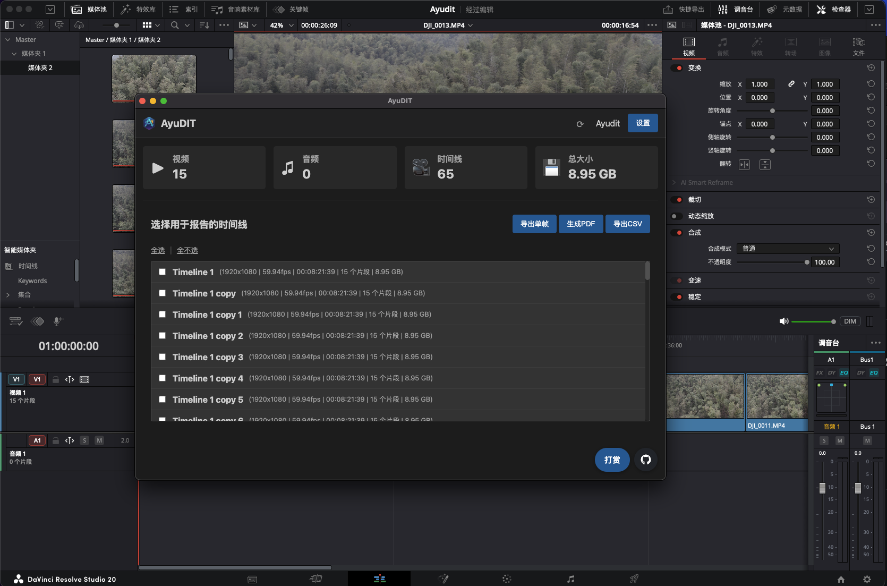

# AyuDIT：基于达芬奇打造的、无需订阅的专业DIT报告生成插件

`AyuDIT` 不仅仅是一个插件，它是直接构建在 DaVinci Resolve Studio 内部的一套完整而强大的DIT（数字影像工程师）软件解决方案。是 **Pomfort Silverstack Lab**、**Foolcat** 等昂贵年度订阅软件的完美替代品，并且**完全免费****开源**。

`AyuDIT` 的愿景诞生于后期制作领域的一次重大变革。随着达芬奇20版本开始原生支持 **Apple ProRes RAW**，这个平台已经成为一个真正意义上的“万金油”工具，几乎能够处理所有格式，并统一整个后期制作流程。

所以我觉得针对于一些普通中小型组的DIT工作组只使用达芬奇来完成拷贝、DI、报告，就足够了，于是有了开发这个插件的想法。也希望还有做这行的人来添加一些更实用的功能。

## 捐赠
如果您觉得这个项目对您有帮助，可以扫描下方二维码请我喝杯咖啡。您的每一份支持都将激励我做得更好！

## 核心功能

-   **仪表盘四张卡片**：视频、音频、时间线、总大小（媒体池去重后的媒体总占用）。
-   **多时间线选择 + 拖拽排序**：按所选顺序生成报告。
-   **PDF 报告（含缩略图）**：每条时间线一页，展示关键信息；支持可选封面页（居中排版），包含 Logo、当前日期、项目统计、DIT 人名、自定义字段。
-   **CSV 导出**：导出所选时间线内每个片段的全部元数据。
-   **单帧缩略图导出**：
    -   导出全部时间线素材单帧
    -   仅导出标记素材单帧（使用“时间线标尺上的彩色 Marker”）
    -   文件命名：`时间线名称-时间码.jpg`
    -   导出目录名跟随语言，如 `Stills_<项目>_<YYYYMMDD_HHMMSS>` 或 `单帧_...`
-   **缩略图来源可配置**：首帧 / 中间帧（默认）/ 尾帧（用于 PDF 和“导出全部素材单帧”）。
-   **置顶进度弹窗**：带实时百分比与快捷操作按钮。
-   **多语言**：中/英。
-   **刷新与自动刷新**：头部刷新按钮 + 自动刷新（默认 300 秒），同时更新时间线列表与仪表盘数据。

## 系统要求

-   **DaVinci Resolve Studio 20.2 或更高版本。**
-   **必须**使用 Studio 版本。

## 安装说明

# AyuDIT - 安装部署说明

本指南将引导您完成 AyuDIT 插件在 DaVinci Resolve Studio 中的安装过程。

## 系统要求

- DaVinci Resolve Studio 20.2 或更高版本。
- 您电脑的管理员权限。

## 安装步骤

1.  **下载插件**
    -   从 [GitHub Releases](https://github.com/AyuTao/AyuDIT/releases) 页面下载最新的发行包 (`AyuDIT.zip`)。

2.  **解压文件**
    -   解压下载的 `AyuDIT.zip` 文件，您会得到一个名为 `AyuDIT` 的文件夹。

3.  **拷贝插件文件夹**
    -   将整个 `AyuDIT` 文件夹拷贝到达芬奇的 “Workflow Integration Plugins” 目录中。

    -   **在 macOS 系统:**
        -   该目录位于:
        -   `/Library/Application Support/Blackmagic Design/DaVinci Resolve/Workflow Integration Plugins/`

    -   **在 Windows 系统:**
        -   该目录位于:
        -   `%PROGRAMDATA%\Blackmagic Design\DaVinci Resolve\Support\Workflow Integration Plugins\`
        -   您可以直接将此路径复制并粘贴到文件资源管理器的地址栏中访问。
        

4.  **重启达芬奇**
    -   如果达芬奇正在运行，请完全关闭并重启它。

5.  **启动插件**
    -   重启后，您可以在达芬奇的顶部菜单中找到并启动本插件：

## 使用方法

# AyuDIT - 使用教程

欢迎使用 AyuDIT 达芬奇插件！本教程将说明如何使用插件的各项功能来监看项目并生成专业的DIT报告。

## 1. 主仪表盘

启动插件后，您将看到主仪表盘界面，它提供了对当前项目的整体概览。

-   **顶部信息栏**：
    -   **刷新**：点击左侧刷新图标，同时刷新仪表盘与时间线列表。
    -   **项目名称**：当前打开的项目名称。
    -   **设置**：打开设置面板。

-   **统计卡片（四张）**：
    -   **视频**：媒体池中的视频素材数量。
    -   **音频**：媒体池中的纯音频素材数量。
    -   **时间线**：项目中的时间线数量。
    -   **总大小**：媒体池中去重后的素材总占用容量。

## 2. 生成报告

主仪表盘下方是报告生成区域。

### 2.1. 选择时间线

-   **时间线列表**: 此区域列出了您当前项目中的所有时间线。对于每一条时间线，您可以看到其关键信息：
    -   分辨率 (例如, 1920x1080)
    -   帧率 (fps)
    -   总时长
    -   媒体片段数量
    -   该时间线所用到的不重复媒体文件的总大小。
    -   当你为卡1卡2创建时间线后，也是现实卡1卡2的文件大小、素材数量，时长。
-   **选择**: 使用复选框来选择一条或多条您希望包含在报告中的时间线。
-   **控制**:
    -   **全选 / 取消全选**: 使用这些链接来快速选择或取消选择列表中的所有时间线。
    -   **拖拽排序**: 您可以点击并拖拽列表中的任何时间线来重新排序。最终的报告将按照您设定的顺序生成。

### 2.2. 生成报告

当您选择并排序好时间线后，有两个导出选项：

-   **生成PDF**：按时间线分页生成排版清晰的 PDF，包含缩略图与关键信息。支持可选封面页（居中排版），包含 Logo、当前日期、项目统计、DIT 人名、自定义字段。
-   **导出CSV**：导出所选时间线内每个片段的全部元数据（CSV）。

### 2.3. 导出单帧

-   点击“导出单帧”打开模式选择。
-   模式：
    -   **导出全部时间线素材单帧**：按设置的缩略图来源（首/中/尾）为每个素材导出一张图片。
    -   **仅导出标记素材单帧**：按时间线标尺上的彩色 Marker 导出，每个标记导出一张。若无标记会给出提示。
-   文件命名：`时间线名称-时间码.jpg`
-   导出文件夹名称跟随语言，例如：`Stills_<项目>_<YYYYMMDD_HHMMSS>` 或 `单帧_...`。

### 2.4. 进度与完成

-   点击任一导出按钮后，会弹出一个进度框，显示报告的生成状态。
-   当报告生成完毕，弹窗会提供三个选项：
    -   **打开文件**: 直接打开刚刚生成的PDF或CSV文件。
    -   **显示文件所在目录**: 打开保存文件的文件夹。
    -   **OK**: 关闭对话框。

## 3. 设置

点击右上角的 **设置** 按钮来打开设置弹窗。

-   **Language (语言)**：切换中/英（对话框标题、导出目录前缀也会随语言变化）。
-   **Auto Refresh (自动刷新)**：定时刷新，同时更新时间线列表与仪表盘数据。
-   **Interval (sec) (间隔(秒))**：自动刷新间隔（默认 60 秒）。
-   **Thumbnail Source (缩略图来源)**：用于 PDF 及“导出全部素材单帧”的源帧。
    -   **First Frame (首帧)**
    -   **Middle Frame (中间帧，默认)**
    -   **Last Frame (尾帧)**
-   **Report Logo（报告 Logo）**：更换/重置 PDF 中显示的 Logo。
-   **PDF Cover Page（PDF 封面页）**：
    -   是否包含封面页
    -   DIT 人名
    -   自定义字段（每行一个，例如：`客户: ACME`）
## 4. 小贴士

-   导出前请至少选择一条时间线。
-   可通过拖拽对时间线进行排序。
-   “仅导出标记素材单帧”使用的是“时间线标尺上的 Marker”（不是媒体池 Good Take 元数据）。
-   不确定时，中间帧通常是最稳定的缩略图选择。

小贴士：

- 导出前需至少选择一条时间线。
- “仅导出标记素材单帧”需先在“时间线标尺”添加彩色 Marker。
- PDF 封面页（启用/禁用、DIT 人名、自定义字段、Logo）均在设置内配置。

## 授权协议

本项目采用 **GNU General Public License v3.0** 授权。这意味着如果您使用、分发或修改此代码，您也必须将您的衍生作品在相同的许可下开源。详情请参阅 [LICENSE](LICENSE) 文件。

